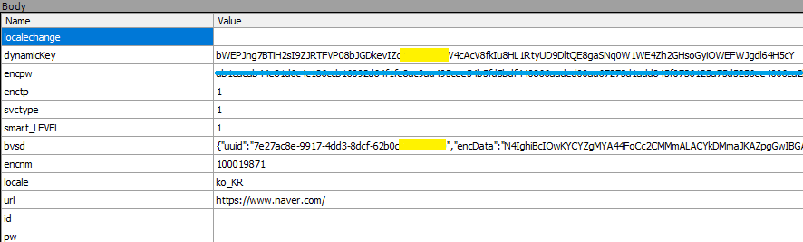
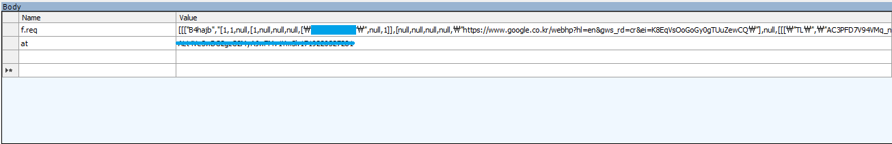
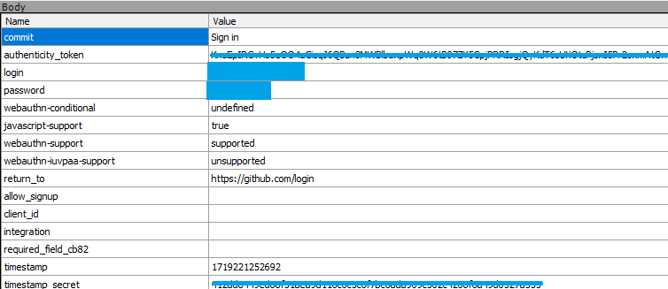

# Fiddler를 사용한 웹 보안 점검 에세이

## 서론
보안의 중요성이 점점 더 커지고 있다. 특히 웹 애플리케이션에서 사용자 데이터를 안전하게 보호하는 것은 매우 중요하며,  Fiddler라는 툴을 사용하여 웹사이트의 로그인 과정에서 데이터가 어떻게 전송되는지 분석하고, 보안 취약점을 파악하려 한다. 대표적으로 많이 쓰이는 사이트인 Google, Naver, GitHub를 대상으로 하여, 각 사이트가 로그인 정보를 어떻게 처리하는지 확인하였다.

## Fiddler 사용
먼저, Fiddler를 설치하고 HTTPS 트래픽을 캡처할 수 있도록 설정하였으며 이를 통해 브라우저와 서버 간에 주고받는 모든 데이터를 확인할 수 있었다.  Capturing 기능을 사용하여 트래픽을 캡처하고, 로그인 과정에서 전송되는 데이터를 분석하였고, 때에 따라서는 Automatic Breakpoints를 사용하여 request를 순간포착하였다.

## 사이트별 분석

### Naver

- 분석 내용:
	- Naver의 로그인 과정에서 비밀번호는 encpw 필드를 통해 암호화된 형태로 전송됨
	- 또한, dynamicKey와 bvsd와 같은 필드도 암호화되어 있으며, JSON 형태의 데이터가 포함되어 있음
	- 이는 Naver가 사용자 데이터를 보호하기 위해 클라이언트 측에서 암호화를 적용하고 있음을 보여줌
- 보안 강점:
	- HTTPS 프로토콜을 사용하여 데이터 암호화
	- 비밀번호를 포함한 민감한 정보를 암호화하여 전송
JSON 데이터도 암호화하여 전송

### Google

- 분석 내용:
	- Google의 로그인 과정에서는 비밀번호가 평문으로 전송되는 것을 확인할 수 있음
	- 그러나 실제로는 HTTPS를 통해 전송되므로, 네트워크 상에서 데이터는 암호화되어 안전하게 전송됨
	- f.req와 at 필드를 통해 인코딩된 데이터를 전송함
- 보안 강점:
	- HTTPS 프로토콜을 사용하여 데이터 암호화
	- 인증 토큰을 사용하여 세션 관리

### GitHub

- 분석 내용:
	- GitHub의 로그인 과정에서도 비밀번호가 평문으로 전송됨
	- HTTPS를 통해 데이터가 암호화
	- GitHub는 authenticity_token 필드를 통해 CSRF 공격을 방지하고, 다양한 보안 설정 필드를 포함하여 보안을 강화함
- 보안 강점:
	- HTTPS 프로토콜을 사용하여 데이터 암호화
	- CSRF 공격을 방지하기 위한 토큰 사용
	- 다양한 보안 설정 필드 포함

## 결론
Fiddler를 사용하여 웹사이트의 로그인 과정에서 데이터가 어떻게 전송되는지 확인할 수 있었다. Naver, Google, GitHub 세 가지 사이트는 모두 HTTPS 프로토콜을 사용하여 데이터를 암호화하지만, Naver는 추가적으로 클라이언트 측에서 비밀번호를 암호화하여 전송하는 보안 강점을 가지고 있음을 확인할 수 있었다.

웹 애플리케이션 개발 시, 이러한 보안 취약점을 미리 파악하고 개선하는 것은 매우 중요하다. 비밀번호와 같은 민감한 정보는 가능한 한 클라이언트 측에서 암호화하여 전송하고, 추가적인 보안 토큰을 사용하여 CSRF 공격을 방지하는 등의 방법을 통해 보안을 강화할 수 있다. 앞으로도 Fiddler와 같은 툴을 적극 활용하여 보안 점검을 지속적으로 수행할 예정이다.